Creates test cases and publishes test results in
[Zephyr](http://www.getzephyr.com) Enterprise for JUnit
test cases

Older versions of this plugin may not be safe to use. Please review the
following warnings before using an older version:

[CSRF vulnerability and missing permission check allow
    SSRF](https://jenkins.io/security/advisory/2019-04-03/#SECURITY-993)


## **About the Plugin**

The Zephyr Enterprise Test Management plugin for Jenkins integrates Jenkins 
with Zephyr Enterprise Edition and with Zephyr Community Edition. Use the 
plugin to create test cases and to publish test results in Zephyr Enterprise
for JUnit test cases in Jenkins. The plugin supports publishing test results
in the Maven Surefire format (used in JUnit and TestNG).
This guide explains how to create and execute test cases automatically in
Zephyr Enterprise by using this plugin. You will learn how to:

* Download and install the plugin.
* Add Zephyr servers to the Jenkins global settings. 
* Configure a standard Jenkins job. 
* Configure the Zephyr Enterprise Test Management plugin to perform post-build actions. 
* Trigger a job and publish the results in Zephyr.

## **Requirements**

* Zephyr Enterprise 6.X.
* Jenkins 2.62 or later.

## **1. Download and install the plugin**

1\. In your Jenkins instance, click **Manage Jenkins** > **Manage Plugins**:

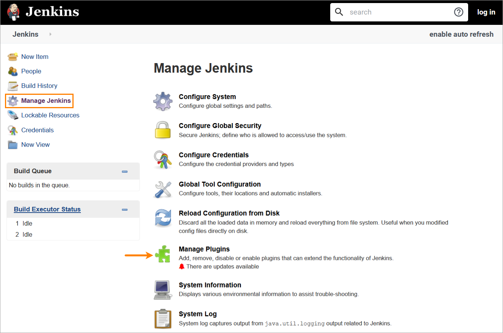

2\. On the subsequent page, switch to the **Available** tab and search for the **Zephyr Enterprise Test Management** plugin: 

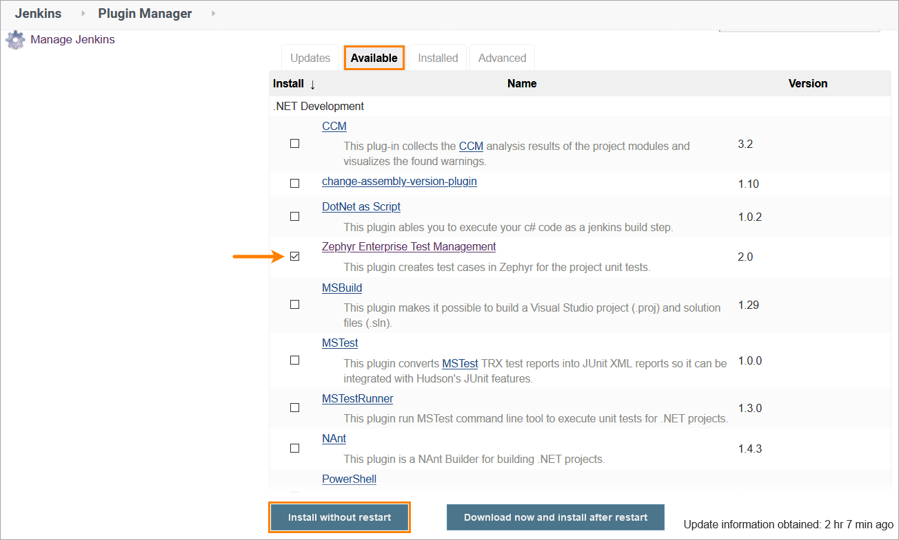

3\. Select the check box next to the plugin name and click **Install without restart**.
   Jenkins will install the plugin and inform you that the plugin has been downloaded and installed successfully:
   
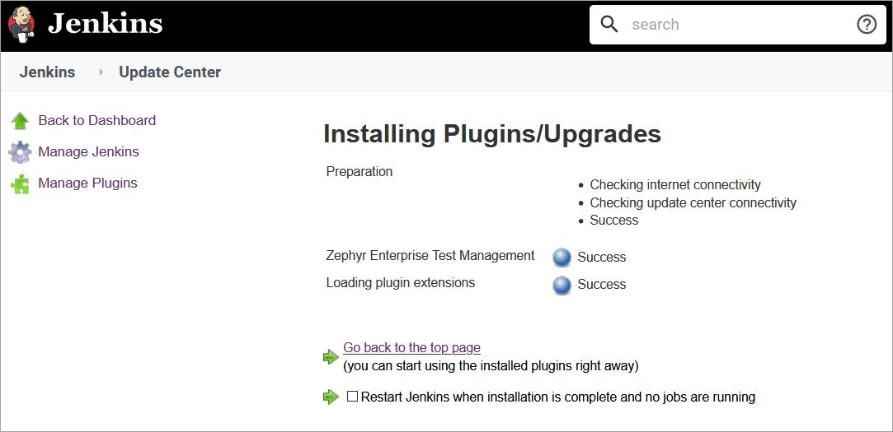

## **2. Add Zephyr servers to the Jenkins global settings**

After you install the plugin, you can configure the Jenkins global settings to establish a connection to one or
several Zephyr servers. You can do this in two ways:  

**Option 1**  

1\. Click **Manage Jenkins** > **Configure System**: 

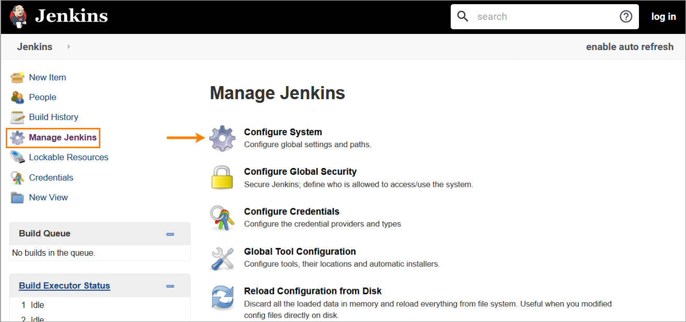

2\. Locate the **Zephyr Server Configuration** section and click **Add** (you can add as many servers as you want): 

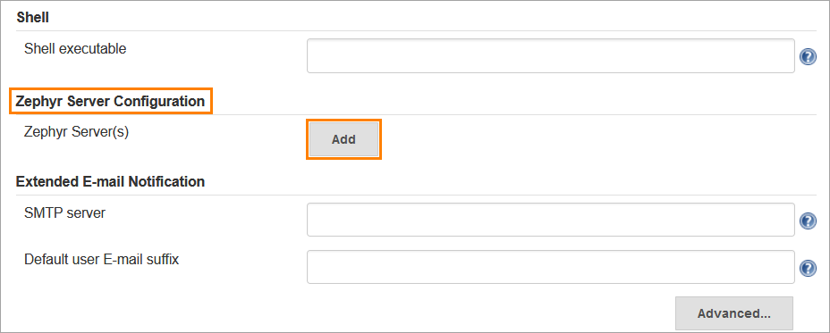

3\. Enter your Zephyr Server URL.
4\. Enter your Zephyr credentials. To do that:  
  * Click **Add** next to the **Credentials** field and select **Jenkins**:

    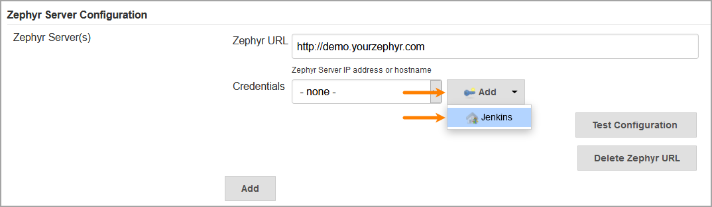

  * In the subsequent window, select **Username with password** from the **Kind** drop-down menu, specify your
    Zephyr username and password, and click **Add**.  
    **Important**: you must specify the credentials of a Zephyr administrator.

    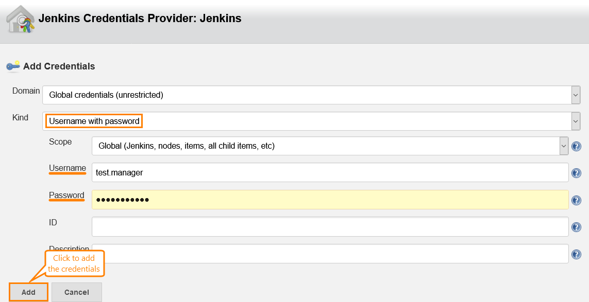

**Option 2**  

1\. Log in to Zephyr as an administrator, create an API token, and copy it to the clipboard:

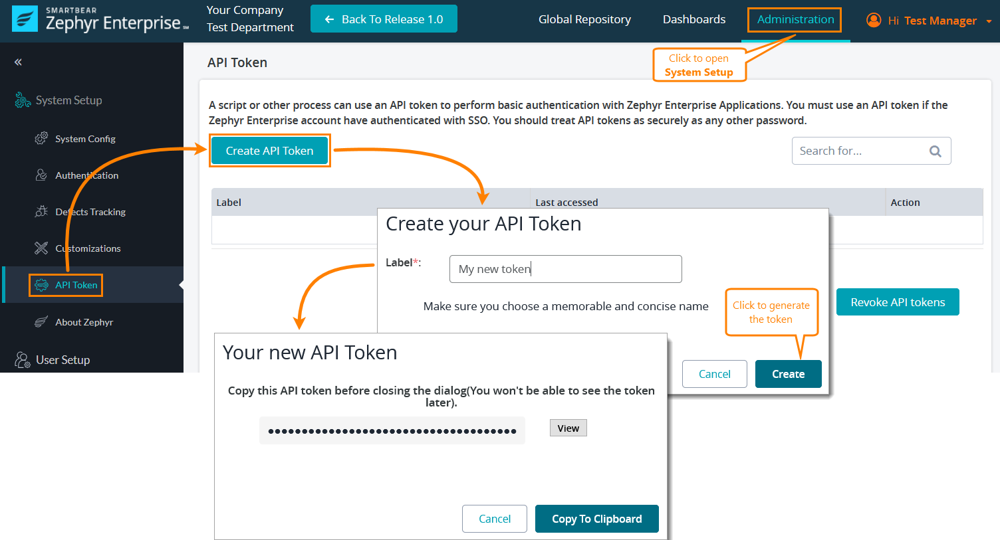

2\. On the **Jenkins Configuration** page, click **Add** next to the **Credentials** field and select **Jenkins**:


3\. In the subsequent window, select **Secret text** form the **Kind** drop-down menu, paste your API token to the **Secret**
   field, specify a short description in the **Description** field, and click **Add**:

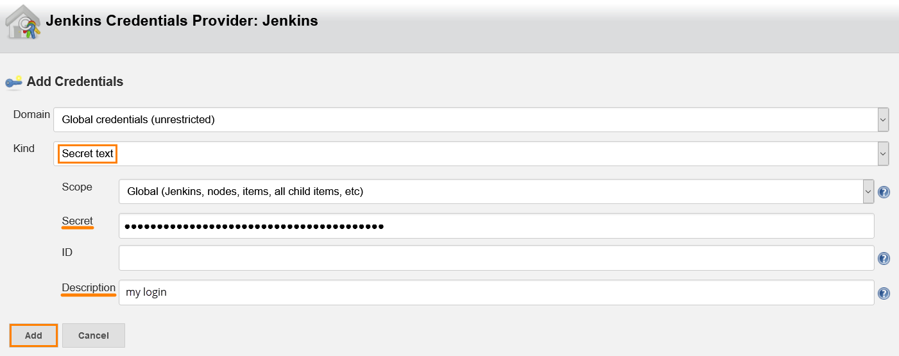

After adding your credentials in any of the ways described above, choose them from the **Credentials** drop-down menu, click
**Test Configuration** to validate the connection to your Zephyr server, and then, if the validation was successful, click **Save**
to apply the changes:

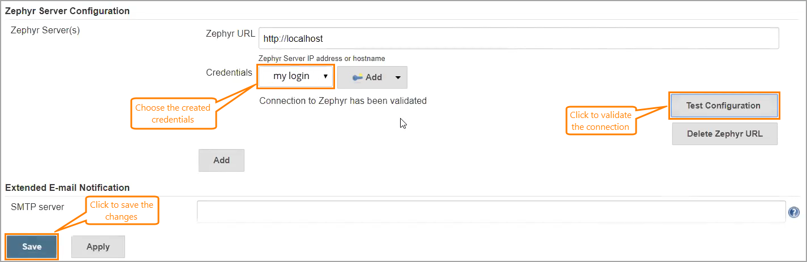

## **3. Configure a standard Jenkins job**

A job in Jenkins defines a sequence of tasks for Jenkins to perform.
When a job is triggered, Jenkins looks for an Ant script or a Maven
build file and runs it. It also provides options to define post-build actions.
To configure a standard job and add a post-build action: 

1\. Click **New Item** in the main Jenkins menu to create a new job:

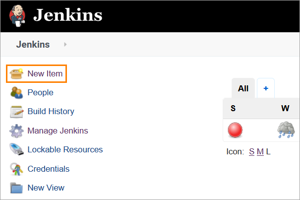

2\. On the subsequent page, specify a name for your job, select **Freestyle project**, and click **OK**:

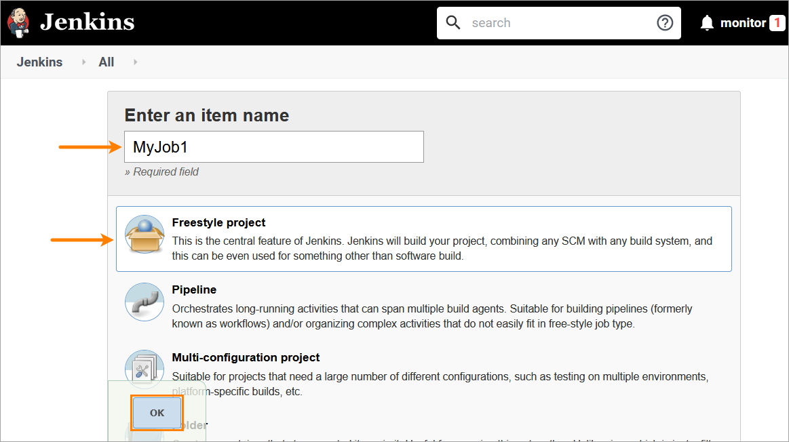

3\. On the resulting page, select **Subversion** in the **Source Code Management** section and enter the
Subversion URL where the target project resides:

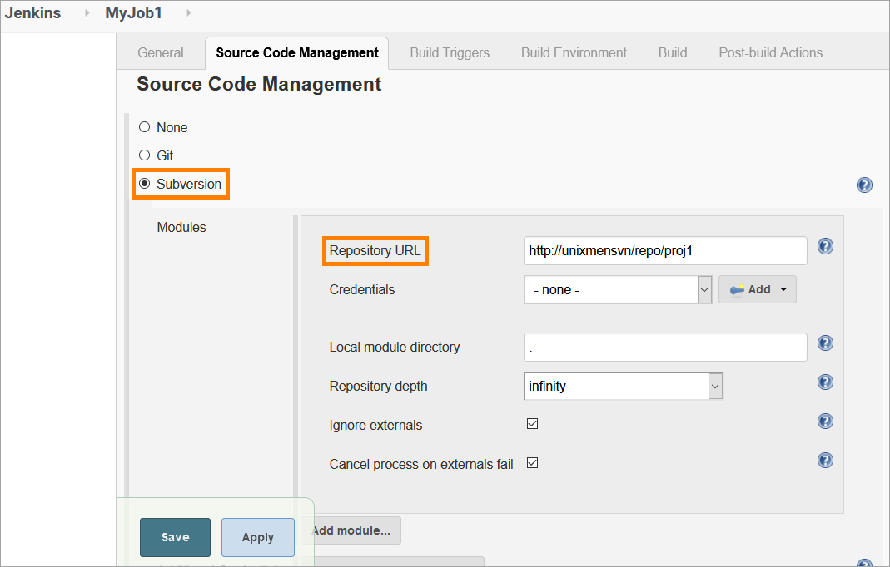

  **Note**: You may need to specify user credentials to access the SVN server. To do that, click **Add** next to the **Credentials** field. 

4\. In the **Build** section, click **Add build step** and select **Invoke top-level Maven targets** from the menu to add a build step:

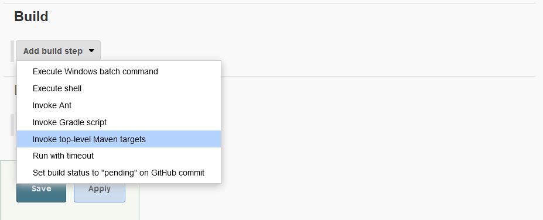

5\. In the **Goals** field, specify *clean package*:

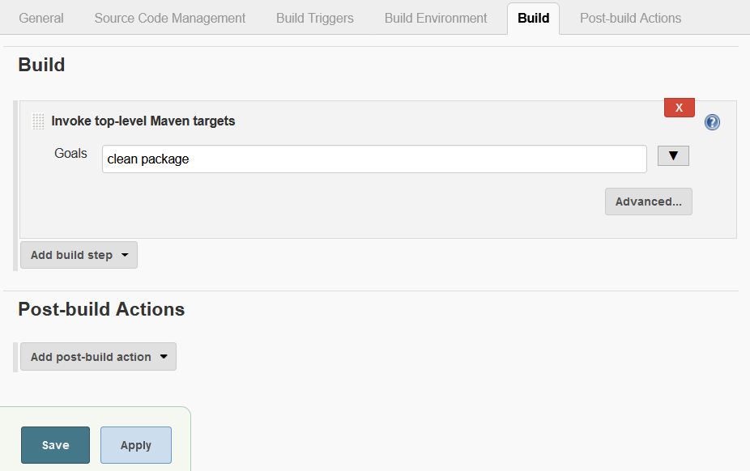

6\. Specify a post-build action. You can command Jenkins to publish test results to
   Zephyr after the build steps are performed. To do that:  
  * Click **Add post-build action** in the **Post-build Actions** section and select
  **Publish test result to Zephyr Enterprise** from the menu:

   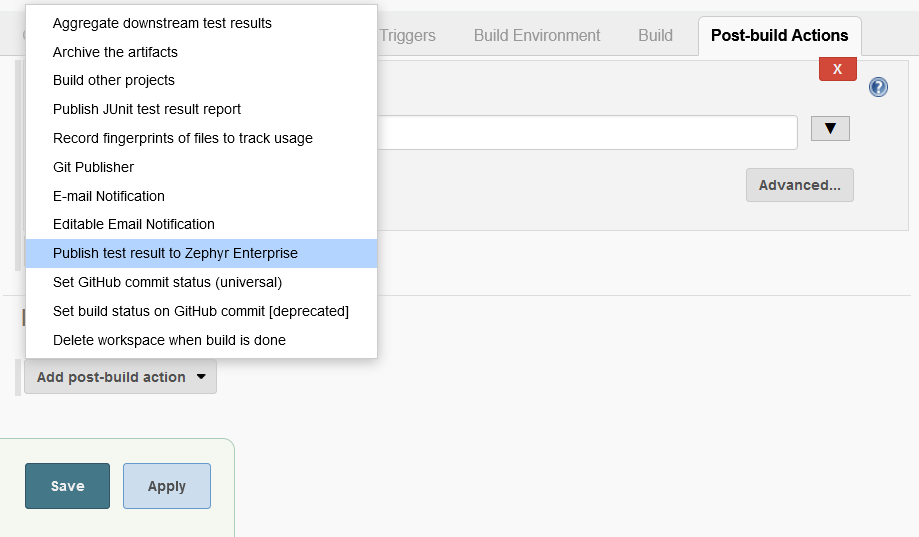

  * Populate the following fields:
  
  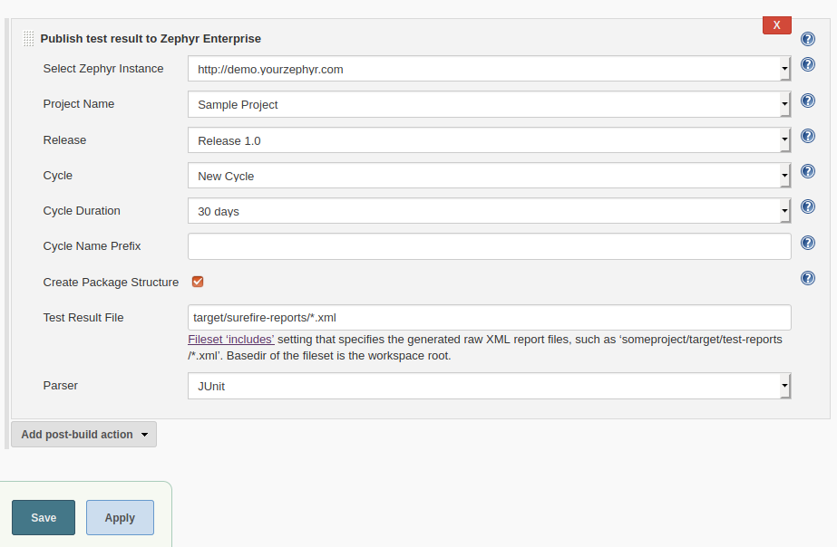
  
  * Select your Zephyr URL from the dropdown (the servers you specified on the Jenkins global configuration page are available here).
    This automatically pulls in Zephyr projects, releases and cycles. 
  * Select the name of your Zephyr project. This re-populates the releases. 
  * Select a release. Selecting a release fetches all its cycles. 
  * Select either an existing cycle or create a new one.  
    
    **Note**: For an existing cycle, the default cycle duration will be the value it has in Zephyr, and the cycle name prefix will be in the format *Automation_<Date><Time>*.  
      For a new cycle, you can select a cycle duration from the dropdown and edit the default cycle prefix name. In the absence of a cycle prefix name, *Automation* is used for new cycles. 

  * To create a package structure while creating and organizing the test cases, select the **Create Package Structure** check box. 
  * Specify the path to the test result file to parse. 
  * Select a parser template to parse the XML file. 

7\. Click **Save** to apply the changes.

## **4. Trigger the job and publish results in Zephyr**

You trigger your job manually. To do that:

1\. Open the job and click **Build Now** in the menu on the left. This will build the project and publish the JUnit result:

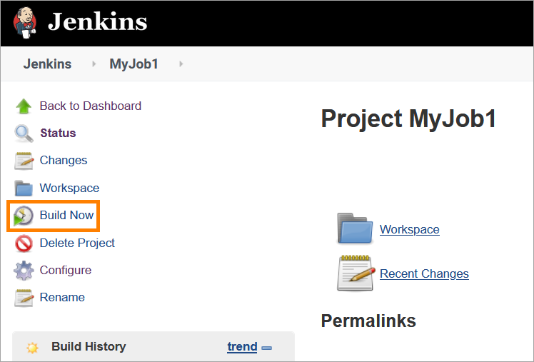

2\. In Zephyr Enterprise, Jenkins will create a new phase, *Automation*, along with the package structure of the JUnit test cases found in the project:

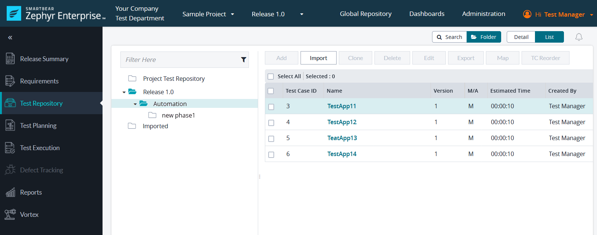

3\. Finally, Jenkins will assign this phase to the selected cycle and will execute all the tests in Zephyr: 
	
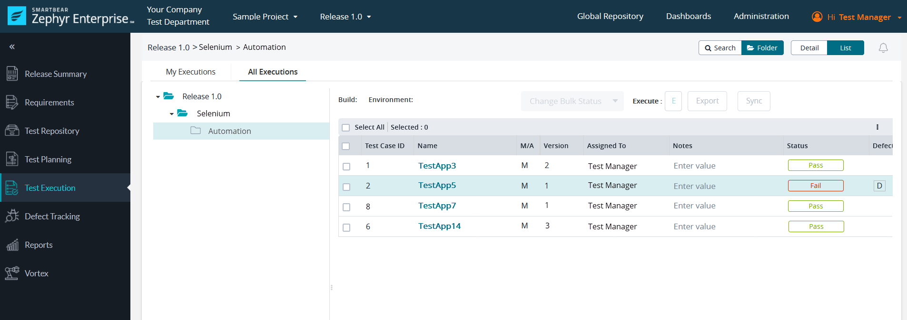
	
## **5. Configure a Pipeline Jenkins job**
	
To configure a Pipeline Jenkins job, do the following:

1\. Click **New Item** in the Jenkins main menu: 


2\. In the subsequent window, enter a name for your job, select **Pipeline**, and click **OK**:

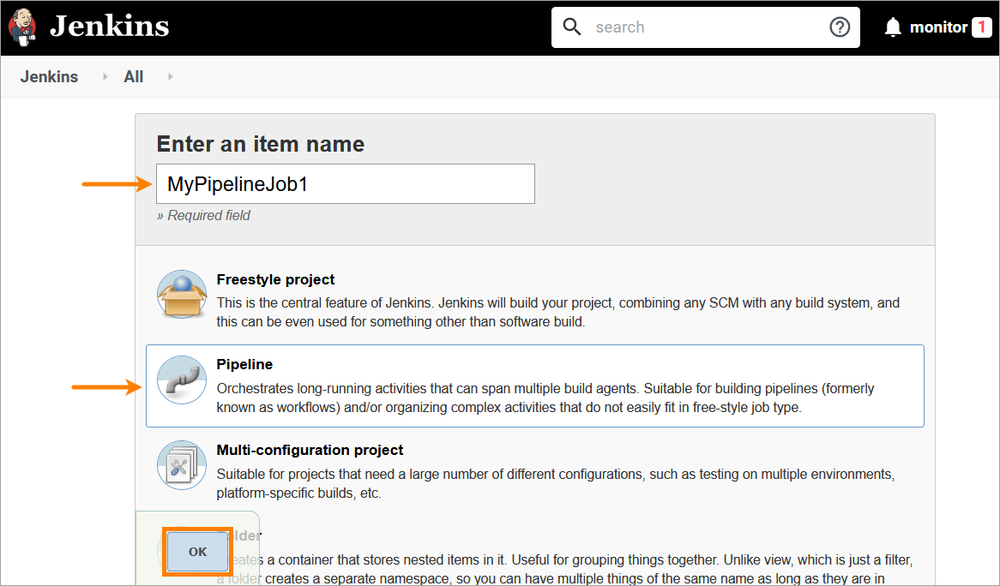

3\. In the **Pipeline** section, select **Pipeline script** from the **Definition** drop-down menu: 

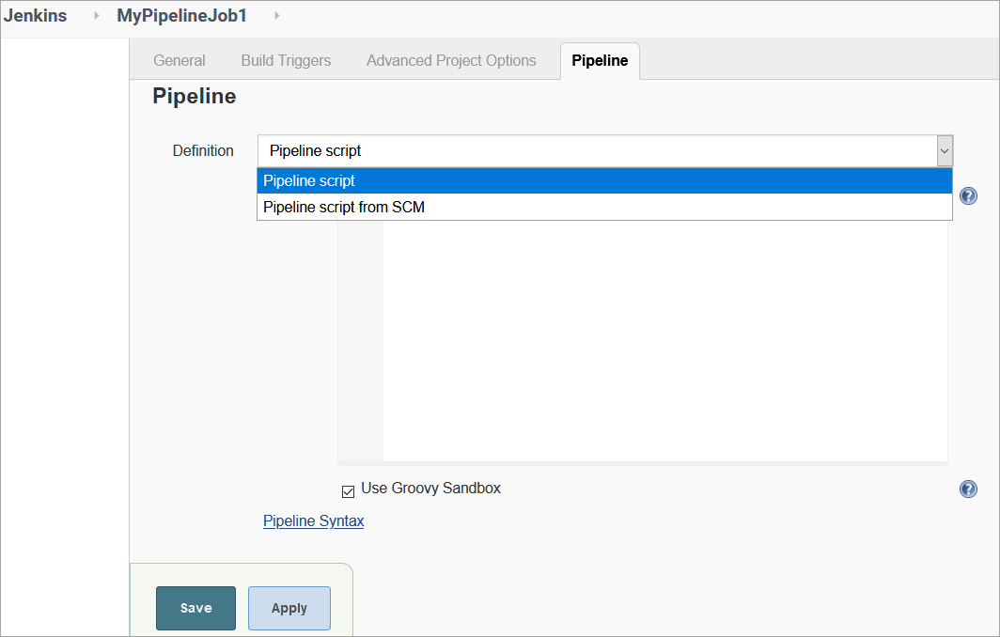

4\. Enter your Pipeline script in the **Script** section and click **Pipeline Syntax**: 

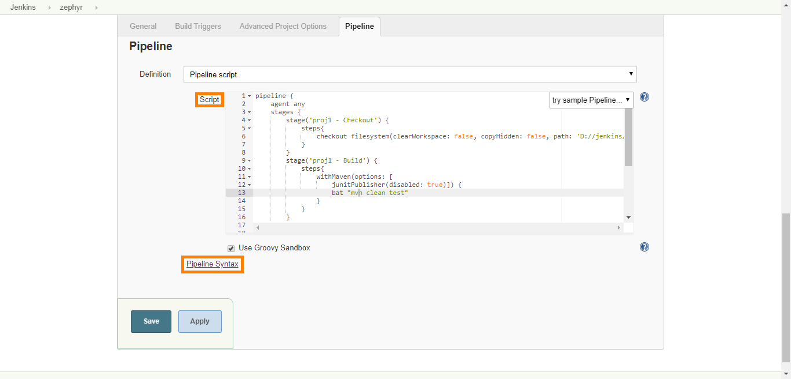

5\. In the subsequent window, select **zeeReporter: Publish test result to Zephyr Enterprise** from the **Sample Step** dropdown: 

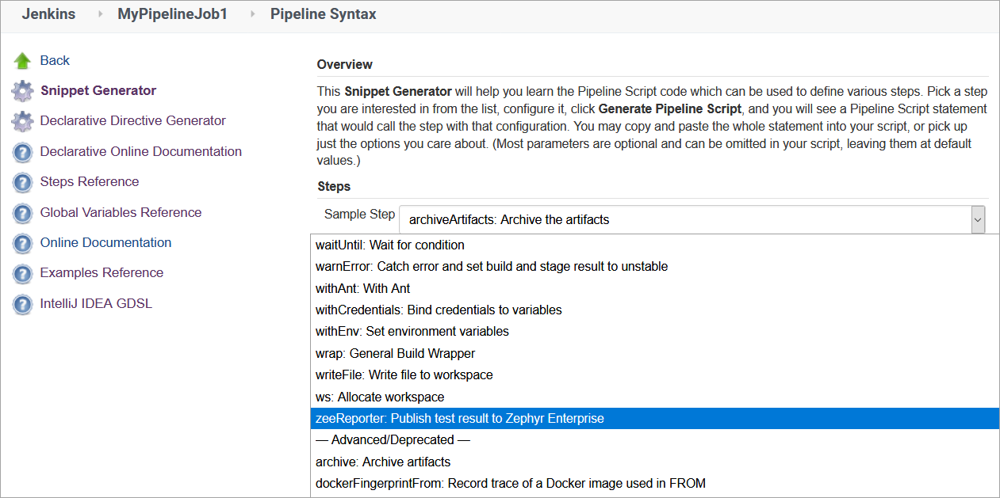

6\. In the fields that appear, specify the project name, release number, cycle name and other details, then click **Generate Pipeline Script**, and copy the
   generated script to the clipboard:

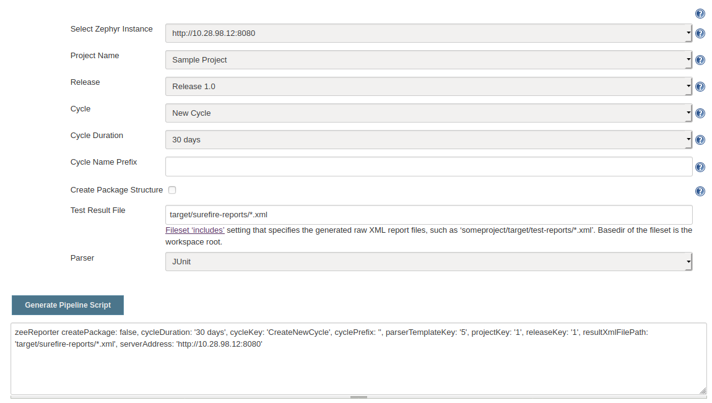

7\. Return to the **Script** field of the **Pipeline** section. In the **Script** field:
  * Paste the copied script to the `post` section of your code.
  * Specify the path to your project in the following line:  
    `checkout filesystem(clearWorkspace: false, copyHidden: false, path: 'D://jenkins//Proj1-10')`  
	**Important**: Use the `bat` command if your pipeline will run on Windows, or the `sh` command if your pipeline will run on Linux. 

**Sample script**  
```
pipeline {
    agent any
        stages {
            stage('proj1 - Checkout') {
                steps{
                    checkout filesystem(clearWorkspace: false, copyHidden: false, path: 'D://jenkins//Proj1-10')
                }
            }
            stage('proj1 - Build') {
                steps{
                    withMaven() {
                        bat "mvn clean test"
                    }
                }
            }
        }
        
    post {
        always{
            zeeReporter createPackage: false, cycleDuration: '30 days', cycleKey: 'CreateNewCycle', cyclePrefix: '', parserTemplateKey: '5', projectKey: '1', releaseKey: '1', resultXmlFilePath: 'target/surefire-reports/*.xml', serverAddress: 'http://demo.yourzephyr.com'
        }
    }
}
```

8\. Click **Save** to apply the changes:

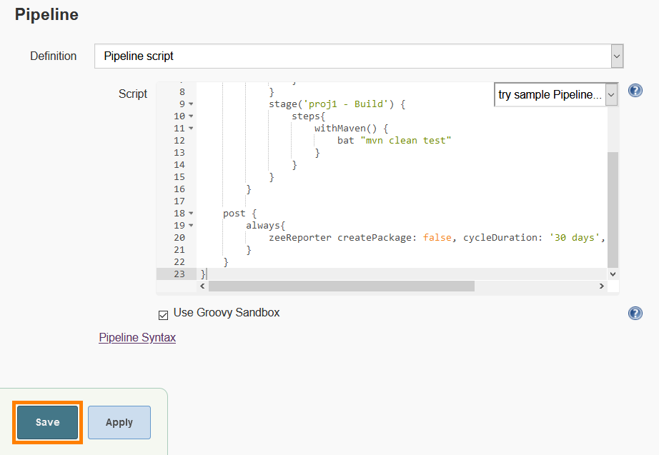

Now you can trigger your build.

## **License**

This plugin is open source. It follows the Apache License version 2.0
(<http://www.apache.org/licenses/>). It means that it allows you to --  

* Freely download and use this software, in whole or in part, for personal, company internal, or commercial purposes. 
* Use this software in packages or distributions that you create. 

It forbids you to -- 

* Redistribute any piece of our originated software without proper attribution. 
* Use any marks owned by us in any way that might state or imply that we, [www.getzephyr.com](http://www.getzephyr.com), endorse your distribution.
* Use any marks owned by us in any way that might state or imply that you created this software in question. 

It requires you to --

* Include a copy of the license in any redistribution you may make that includes this software. 
* Provide clear attribution to us, [www.getzephyr.com](http://www.getzephyr.com), for any distributions that include this software.

It does not require you to --

* Include the source of this software itself, or of any modifications you may have made to it, in any redistribution you may assemble that includes it. 
* Submit changes that you make to the software back to this software (though such feedback is encouraged). 

See License FAQ (<http://www.apache.org/foundation/licence-FAQ.html>) for more information.

## **Feedback**

-   Please provide feedback at [JENKINS
    JIRA](https://issues.jenkins-ci.org/projects/JENKINS)
    or at [Zephyr
    Community](https://support.getzephyr.com/hc/communities/public/topics/200179869-Developer-Zone-Zephyr-Enterprise-Community)
-   For code questions, send an email to
    [developer@getzephyr.com](https://wiki.jenkins.io/display/JENKINS/mailto:developer%40getzephyr.com)
